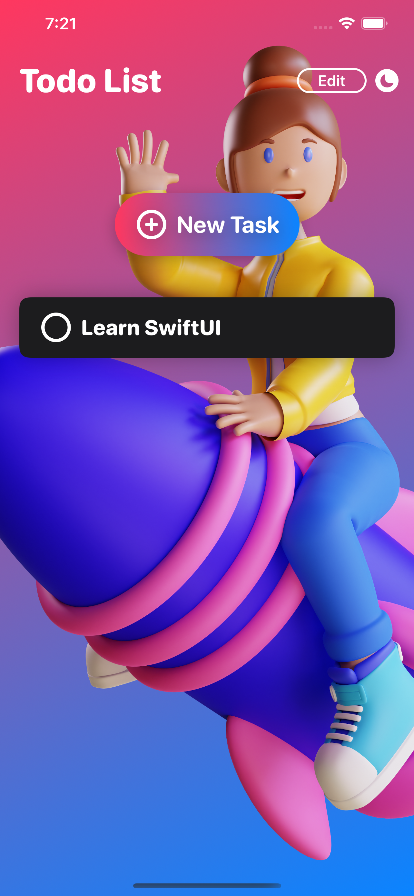

# To-Do-List

A simple todo list app that uses SwiftUI and incorporates sound effects and haptic feedbacks to enhance user experience. 

A widget extension of the app is also included to briefly capture current status of the app. 

